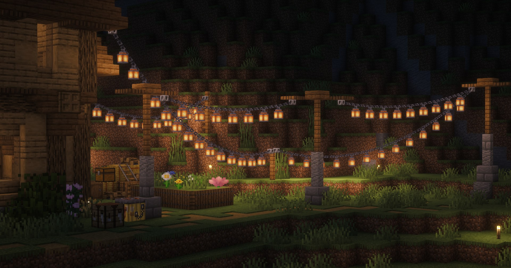
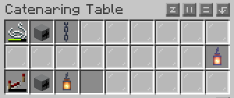
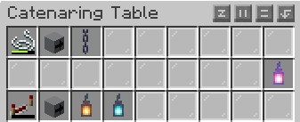
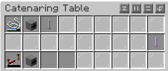

# Кастомные верёвки


Дата-пак ещё в процессе перевода. Какая-то часть может быть не переведена из-за сложностей его сборки.


## Что это?

Это уникальны Дата-Пак добавляющий механику которая позволяет прикреплять Верёвки/Провода/Цепи куда вам захочется.\
\
Также одна из уникальных механик  позволяет вам по ним скользить словно по тросу зацепившись за веревку луком\
\
Веревки имеют множество видов, как с источником света (Лампами/стержнями/фонарями) так и иными блоками. Данный датапак вам поможет задекорировать вашу базу или какуето территорию

## Пример использования

<figure><figcaption></figcaption></figure>

## Крафт "Веревочного стола"

<figure><figcaption></figcaption></figure>

## Крафт Верёвок/тросов/цепей

Тут показаны только примеры. Комбинаций намного больше. Вы можете найти их экспериментируя с крафтами &#x20;

<figure><figcaption></figcaption></figure>

<figure><figcaption></figcaption></figure>

<figure><figcaption></figcaption></figure>

